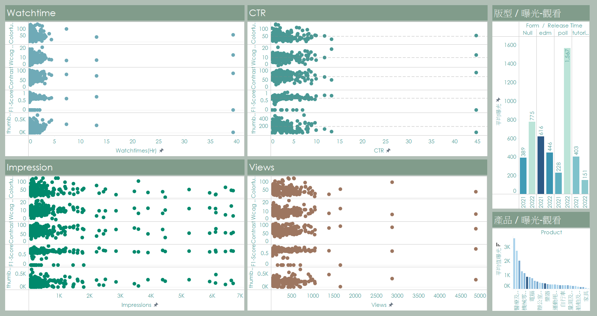

# Video Analysis
Analys from thumbnals, title, text, video type, etc.

Data science with youtube api, cv, ocr, nlp, pandas and ML method

Also using tableau for data visualization

<h2> Data preprocessing </h2>
<h3> text </h3>
<li> bert score </li>

<h3> img </h3>
<li> youtube api </li>
<li> pytesseract ocr </li>
<li> k-means main color clustering </li>
<li> contrast </li>
<li> labelimg tag layout </li>

<h2> Data EDA </h2>
<li> pandas </li>

<li> Tableau </li>

<h2> ML </h2>
<li> K-Means </li>
<li> Logistic Regression </li>
<li> Decission tree </li>
<li> SVM </li>
<li> Bagging </li>
<li> XGBoost </li>
