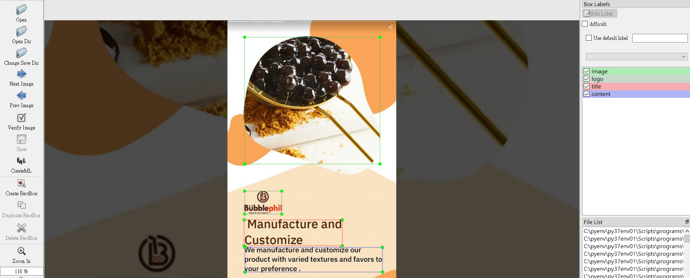

# Video Analysis
Analys from thumbnals, title, text, video type, etc.

Data science with youtube api, cv, ocr, nlp, pandas and ML method

Also using tableau for data visualization

<h2> Data preprocessing </h2>
<h3> Youtube Reporting & Analytics api </h3>
<li> all video meta data (impresion, view, subs, tags, revenue, thumbnails, etc.) </li>
<li> traffic source </li>

<h3> text </h3>
<li> TextFuseNet OCR </li>
<li> bert score </li>

<h3> img </h3>
<li> youtube api </li>
<li> pytesseract ocr </li>
<li> k-means main color clustering </li>
<li> contrast </li>
<li> labelimg tag layout </li>

<h2> Data EDA </h2>
<li> pandas </li>

<li> Tableau </li>

<li> possibility </li>
<table>
  <thead>
    <tr>
      <th></th>
      <th>歷史資料</th>
      <th>ABtest</th>
    </tr>
</thead>
<tbody>
    <tr> 
      <td>參數 - 指標分布</td>
      <td></td>
      <td></td>
    </tr>
    <tr>
      <td>統計: 高低於中位指標的參數機率</td>
      <td></td>
      <td></td>
    </tr>
    <tr>
      <td>Bayes: 參數的高低於中位指標機率</td>
      <td></td>
      <td></td>
    </tr>
    <tr>
      <td>Bayes: 參數的高低於中位指標機率</td>
      <td></td>
      <td></td>
    </tr>
    <tr>
      <td>顯著性</td>
      <td></td>
      <td></td>
    </tr>
</table>

<h2> ML </h2>
<li> K-Means </li>
<li> Logistic Regression </li>
<li> Decission tree </li>
<li> SVM </li>
<li> Bagging </li>
<li> XGBoost </li>
